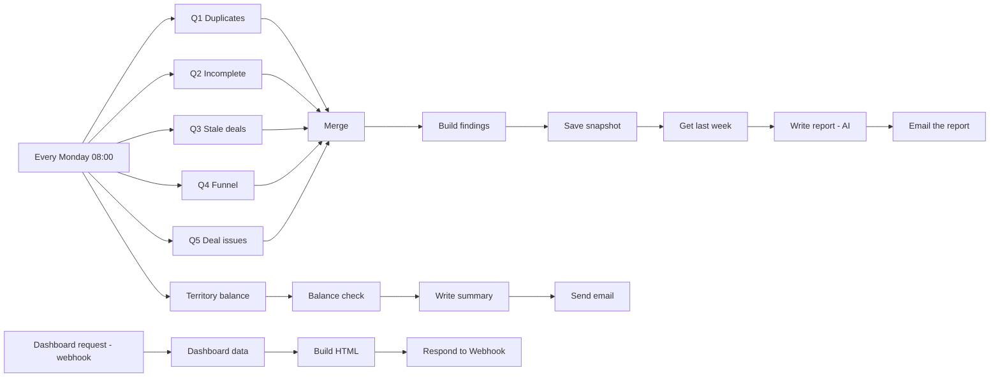

# CRM Hygiene Agent + Capacity Check

An n8n workflow that checks CRM data quality every week, tracks it over time, and sends a short plain-English report to a sales leader. A second flow adds a live dashboard, and a third checks whether accounts and pipeline are split fairly between AEs.

> **Inspired by** the CRM Hygiene Agent by [ARIA994](https://github.com/ARIA994), see [ARIA994/crm-hygiene-agent](https://github.com/ARIA994/crm-hygiene-agent). This version was rebuilt and extended on a self-hosted n8n instance, see [What's different](#whats-different-in-this-version).

## Why this exists

A forecast is only as good as the CRM data under it. Duplicate contacts, stale deals and missing fields quietly distort pipeline numbers and win rates. This project makes those problems visible every week, in numbers a VP of Sales can act on.

**Design principle:** SQL finds the problems, code does all the arithmetic, and the AI only writes the summary. The model never calculates, so every number in the report can be traced back to a query.

> **Scope:** this covers data hygiene and pipeline health, which is the foundation a forecast needs. It is not a forecasting model.

## What it does

| Flow | Trigger | Output |
|---|---|---|
| **Weekly hygiene report** | Every Monday 08:00 | Email with findings and actions, plus a weekly snapshot saved to the database |
| **Live dashboard** | Opening a URL in the browser | HTML page with headline numbers, funnel, stale deals by owner and the last 6 weeks |
| **Territory / capacity check** | Every Monday 08:00 | Email comparing each AE's accounts and pipeline to the team average |

## Architecture



## The hygiene rules

Every rule is a visible SQL threshold, so definitions like "stale" can be agreed with the sales team and changed in one place.

| Check | Rule |
|---|---|
| **Duplicates** | Same first name + last name + email domain (case-insensitive) |
| **No company / no lead source** | Field empty or null |
| **Invalid email** | Empty, or not matching a basic `x@y.z` pattern |
| **Never touched** | Contact has no `last_activity` |
| **Stale deal** | Open deal with no activity for **30+ days** |
| **Value at risk** | Sum of `amount` of stale open deals, grouped by owner |
| **Deal issues** | Open deal with no owner, no amount, a contact that doesn't exist, or open for **180+ days** |
| **Win rate** | Won / (won + lost), open deals excluded |
| **Demo to proposal** | Deals that reached proposal / deals that reached demo done, treating the funnel as cumulative |
| **Territory balance** | Each AE's accounts and open pipeline vs. the team average. Index 100 = average, above 125 = overloaded, below 75 = underloaded |

## Tech stack

- **n8n** (self-hosted)
- **PostgreSQL** for the CRM tables and weekly snapshots
- **Groq** (`openai/gpt-oss-120b`, temperature 0.2) for the report text. The model node can be swapped for another provider without changing the rest of the flow.
- **Gmail** (OAuth2) for delivery. An SMTP node works as a replacement.

## Setup

### 1. Create the database

Create an empty PostgreSQL database (for example `crm`) and run:

```bash
psql -d crm -f sql/schema.sql
psql -d crm -f sql/sample_data.sql   # optional: synthetic demo data
```

`sample_data.sql` contains made-up people and companies with deliberate problems (a duplicate, a stale deal, an unowned deal and so on) so every check has something to find. Dates are relative to today, so the data doesn't go stale.

To use your own data, load CSVs into `contacts` and `deals` with the same column names. Two things matter:
- `email_domain` must be filled (the part after `@`). If it's missing: `update contacts set email_domain = lower(split_part(email, '@', 2)) where email like '%@%';`
- Deal `stage` values must be exactly `New`, `Demo Booked`, `Demo Done`, `Proposal Sent`, `Closed Won`, `Closed Lost`. The funnel logic depends on them.

### 2. Import the workflow

In n8n: **Workflows > Import from file** and choose `workflow/crm_hygiene_agent_capacity_check.json`.

### 3. Create credentials

Credentials are not included in the export. Create and select them in the nodes that show a warning:

| Credential | Used by | Notes |
|---|---|---|
| **Postgres** | All query and snapshot nodes | If n8n runs in Docker and Postgres runs on the host, use `host.docker.internal` as the host |
| **Groq** | Groq Chat Model | API key from console.groq.com. Available model names change, so pick a current chat model from the dropdown if `openai/gpt-oss-120b` is unavailable |
| **Gmail OAuth2** | Email the report, Send a message | Needs a Google Cloud OAuth client. For a quick test, swap in an SMTP *Send Email* node |

### 4. Configure

- In both Gmail nodes, replace `you@example.com` with the recipient.
- Open each of **Q1 duplicates**, **Q3 stale deals**, **Q5 deal issues** and **Get last week**, go to *Settings* and turn on **Always Output Data**. Without it, an empty result (for example no duplicates, or no snapshot on the first run) stops the branch.

### 5. Run it

1. Click **Execute workflow** to run the weekly flow once and check the email.
2. For the dashboard, open the **Dashboard request** webhook node. Use *Listen for test event* and open the test URL, or activate the workflow and open `http://localhost:5678/webhook/crm-dashboard`.
3. Activate the workflow so the Monday schedule runs on its own.

The dashboard's weekly history table fills as snapshots accumulate. It says "No history yet" until the weekly flow has run at least once.

## Screenshots

Add your screenshots to `docs/screenshots/` and reference them here:

```markdown


```

## Customizing

- **Stale threshold:** change `interval '30 days'` in Q3 and in the Dashboard data query.
- **Open-too-long threshold:** change `interval '180 days'` in Q5.
- **Territory thresholds:** change `HIGH` and `LOW` at the top of the **Balance check** code node.
- **Report tone and format:** edit the system message in **Write report (AI)**.
- **Schedule:** edit the **Every Monday 08:00** trigger.

## What's different in this version

- Runs on a **self-hosted n8n** with a local PostgreSQL database and a Groq-hosted model.
- Adds the **territory / capacity check**: per-AE accounts and pipeline compared to the team average, with a rule-based written summary and email.
- Adds **sticky-note documentation** on the canvas that explains each group of nodes.
- Adds a schema file and synthetic sample data so the project can be run from scratch.

## Limitations

- **Not a forecast.** It reports on data quality and pipeline health, which a forecast depends on.
- **Duplicate matching is exact** (name + email domain). It won't catch typos or nicknames.
- **One staleness threshold** (30 days) applies to every stage, although an early-stage deal and a late-stage deal behave differently.
- **Demo-to-proposal conversion** treats every lost deal as having reached the demo and proposal stages, so it can be slightly high if deals are lost earlier.
- **Territory check counts accounts equally** and doesn't consider account size, region or segment.
- Snapshot dates use UTC.

## Ideas for next steps

- Fuzzy duplicate matching.
- Stage-specific staleness thresholds.
- Weight accounts by size and region in the territory check.
- Add the territory section to the weekly report email.
- Alert when a hygiene metric jumps sharply week over week.
- Sync from HubSpot (the `hubspot_id` columns are there for this).

## Project structure

```
.
├── README.md
├── LICENSE
├── .gitignore
├── workflow/
│   └── crm_hygiene_agent_capacity_check.json   # n8n workflow (no credentials)
├── sql/
│   ├── schema.sql                              # tables
│   └── sample_data.sql                         # synthetic demo data
└── docs/
    └── screenshots/
```


## Acknowledgements

Inspired by the work of [ARIA994](https://github.com/ARIA994) and the original [crm-hygiene-agent](https://github.com/ARIA994/crm-hygiene-agent).
